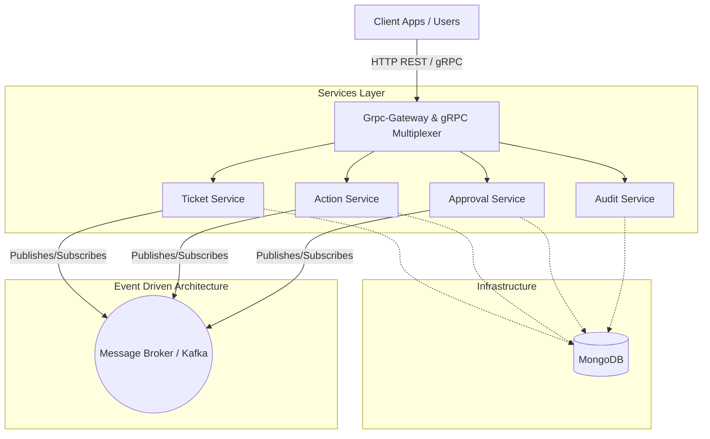
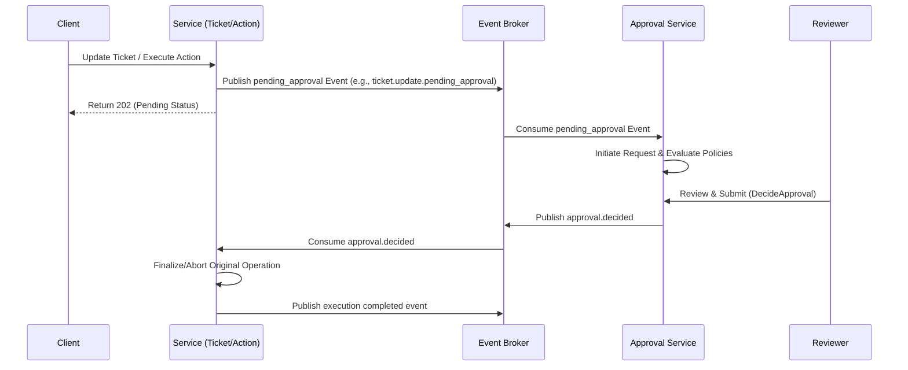
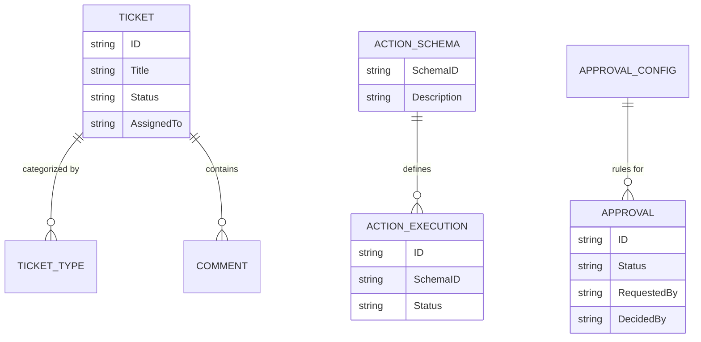

# System Design: Go Support Ticket

## Overview

`go-support-ticket` is a robust and scalable support ticket and workflow management system built in Go. It handles the lifecycle of support tickets alongside executing predefined actions that may require an approval state machine. The system adopts modern, cloud-native patterns with structured event-driven communication and multiplexed gRPC and HTTP access.

## Architecture

The system leans on hexagonal/clean architecture principles, cleanly separating core business contexts into domain-focused services: **Ticket**, **Action**, **Approval**, and **Audit**. 

Persistence is achieved using MongoDB as a document-based store for flexible schemas. Asynchronous decoupling across bounded contexts logic runs over an event broker.

### High-Level Architecture Diagram

## Core Components

The application divides its domain into 4 main bounded contexts implemented as distinct gRPC services exposed on the same API server:

1. **Ticket Service (`TicketServiceServer`)**
   Manages the primary workflows and lifecycles of support tickets. Provides operations like creating/updating tickets, managing comments, merging, and distributing tickets. It delegates sensitive updates to an approval channel by broadcasting specific events (`ticket.update.pending_approval`, `ticket.merge.pending_approval`).
2. **Action Service (`ActionServiceServer`)**
   Executes deterministic automated actions defined by `ActionSchema`. It interacts with the rest of the application ecosystem. Executions that need peer review submit an `action.execution.pending_approval` event. 
3. **Approval Service (`ApprovalServiceServer`)**
   Maintains the state machine for an approval flow. Driven by configurations (`ApprovalConfigs`), it orchestrates reviewers answering "Approve" or "Reject". Subscribes to events raised by other services, and publishes back definitive `approval.decided` decisions.
4. **Audit Service (`AuditServiceServer`)**
   Tracks and reads the log trail of events happening across the platform for compliance. Read-only API allowing tracking who did what, and what triggered it.

## Communication & Process Flow

Communication leverages synchronous operations (gRPC + REST via HTTP multiplexing) for requests that can be completed immediately. For multi-step sequences like "Pending Approvals", the system decouples producers and consumers using a Pub/Sub mechanism (e.g., Kafka).

### Example Workflow: Approval Process State Machine

When a sensitive action or ticket update is requested, it starts an asynchronous approval process instead of being finalized instantly.

### Supported Event Types

- **Approval triggers**: `ticket.update.pending_approval`, `ticket.merge.pending_approval`, `action.execution.pending_approval`
- **Approval decisions**: `approval.decided`
- **Action execution tracking**: `action.execution.triggered`, `action.execution.executed`, `action.execution.completed`, `action.execution.status.updated`
- **Ticket lifecycle events**: `ticket.created`, `ticket.updated`, `ticket.assigned`, `ticket.merged`, `ticket.comment.added`, `ticket.deleted`
- **Config & Meta state**: `ticket_type.*`, `action.schema.*`, `approval_config.*`

## Domain Model

The system is explicitly designed for horizontal scaling across nodes, as asynchronous jobs and web server requests act statelessly and use MongoDB to lock state context.
